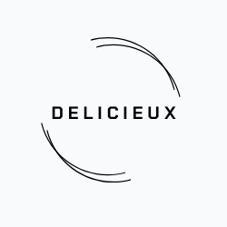

# Welcome to Delicieux 👋


A simple recipe management app built with Expo / React Native.



## Get started

### Requirements

- Expo SDK 54 (use the latest Expo Go)

## Demo

- Web (quick preview): https://delicieux-alpha.vercel.app/ (some UI is optimized for mobile)
- Mobile (recommended): open the project in Expo Go via QR code from `npx expo start`

1. Install dependencies

   ```bash
   npm install
   ```

2. Start the app

   ```bash
   npx expo start
   ```

\*Note  
This project currently runs on stub data (no backend required). Some Firebase-related code is scaffolded for future integration.

## Stack

- React Native - ReactJS-based framework that can use native platform capabilities
- Expo - Toolset for building and delivering RN apps
- React Navigation - Routing and navigation
- NativeBase - Themable component library  
  ...etc

For details, see package.json.
